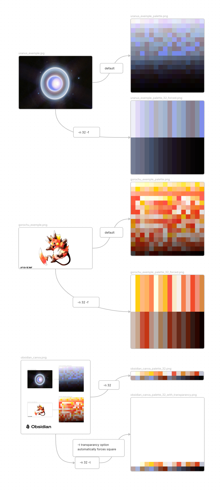

Linux shell script that uses FFmpeg to bulk create palettes from files in the current directory, then ImageMagick to enhance them and optipng for lossless compression.

setup :		$ sudo apt-get install ffmpeg magick optipng

usage (positional) :		$ ./pic2pal [-option] [-flag value]

options :

-n : number of colors : takes '1' to '256' (default is '256')

-t : add transparency color,	useful to create ready-to-use palettes, like for a filter
  
-l : height generated palette, in number of pixels (default is '500')

-w : width of the generated palette, in number of pixels (default is '500')

-f : forces size, useful to have a predictable output

-c : lossless compression of palettes

Exemple :	$ ./pic2pal -n 32 -t -l 1000 -f
			will create a 1000x500 32 colors palettes (31 + transparency)
			for every image in the current directory

wishlist

x flags (done)

x automatic crop with trim (done)

x PNG lossless compression (done)

x not-square-palette building (done)

- other palette building methods like this in go : $ sudo apt-get install golang && go get -u github.com/mccutchen/palettor && palettor -help

